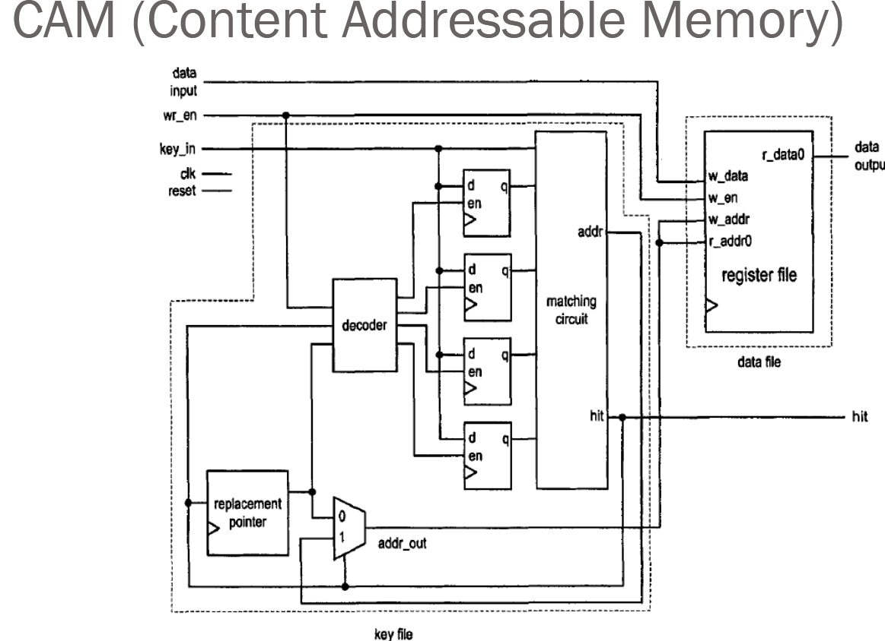
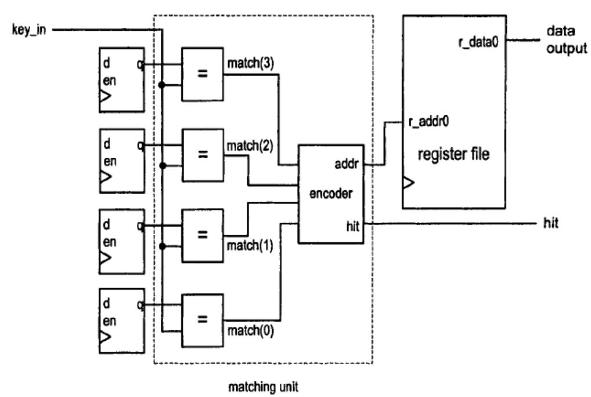

# VHDL Content Addressable Memory (CAM) Implementation

A synthesizable VHDL implementation of a 64-entry Content Addressable Memory (CAM) designed for high-speed lookup operations in FPGA applications.

## 📋 Table of Contents

- [Overview](#overview)
- [Features](#features)
- [Architecture](#architecture)
- [Interface Specification](#interface-specification)
- [Memory Configuration](#memory-configuration)
- [File Structure](#file-structure)
- [Usage](#usage)
- [Synthesis](#synthesis)
- [Testing](#testing)
- [Performance](#performance)
- [Applications](#applications)
- [Contributing](#contributing)

## 🔍 Overview

This project implements a fully synthesizable Content Addressable Memory (CAM) in VHDL, capable of storing 64 key-data pairs with simultaneous search capability. Unlike traditional memory systems that require addresses to access data, CAM allows direct content-based lookup, making it ideal for applications requiring fast search operations such as routing tables, cache implementations, and pattern matching systems.

## ✨ Features

- **64-Entry Capacity**: Stores up to 64 key-data pairs
- **22-bit Key Width**: Supports keys up to 4,194,304 unique values
- **32-bit Data Width**: Each entry stores 32-bit associated data
- **Single Clock Cycle Lookup**: Combinatorial matching for high-speed operation
- **Priority Encoding**: Returns lowest-index match when multiple entries match
- **Round-Robin Replacement**: Automatic replacement policy for full CAM scenarios
- **Synchronous Write Operations**: Clock-synchronized data storage
- **Hit/Miss Detection**: Explicit feedback for search operations
- **Fully Synthesizable**: Designed for FPGA implementation

## 🏗️ Architecture

The CAM implementation follows a modular architecture with clear separation of concerns:

```
CAM Top Level
├── KEY_FILE (Tag Storage & Matching)
│   ├── D_FF Array (64 × 22-bit registers)
│   ├── MATCHING_CIRCUIT
│   │   ├── COMPARATOR Array (64 parallel comparators)
│   │   └── PRIORITY_ENCODER (64→6 bit encoder)
│   ├── REPLACEMENT_POINTER (Round-robin counter)
│   ├── MULTIPLEXER (Address selection)
│   └── DECODER (Write enable generation)
└── DATA_FILE (Associated Data Storage)
    └── Register Array (64 × 32-bit entries)
```



### Key Components

1. **MATCHING_CIRCUIT**: Parallel comparison of input key against all stored tags
2. **PRIORITY_ENCODER**: Identifies the lowest-index matching entry
3. **REPLACEMENT_POINTER**: Maintains next available location for new entries
4. **DECODER**: Generates write enable signals for tag storage
5. **DATA_FILE**: Stores associated data for each CAM entry

## 🔌 Interface Specification

### Input Ports

| Port         | Width  | Description                     |
| ------------ | ------ | ------------------------------- |
| `UNI_CLK`    | 1-bit  | System clock input              |
| `UNI_RST`    | 1-bit  | Synchronous reset (active high) |
| `UNI_KEY_IN` | 22-bit | Search/write key input          |
| `UNI_WR_EN`  | 1-bit  | Write enable signal             |
| `INPUT_DATA` | 32-bit | Data to be written with key     |

### Output Ports

| Port          | Width  | Description                           |
| ------------- | ------ | ------------------------------------- |
| `HIT`         | 1-bit  | Match found indicator (1=hit, 0=miss) |
| `OUTPUT_DATA` | 32-bit | Associated data for matched key       |

## 💾 Memory Configuration

The CAM is configured through the `CAM_PKG.vhd` package file:

```vhdl
-- Configuration Constants
KEY_IN_SIZE           : 22 bits    -- Input key width
KEY_FILE_OUTPUT       : 6 bits     -- Address width (log₂(64))
DATA_SIZE            : 32 bits    -- Associated data width
DECODER_OUTPUT_VECTOR : 64 entries -- Total CAM entries
TAGS_SIZE            : 1408 bits  -- Total tag storage (64×22)
```

### Memory Capacity Analysis

- **Key Storage**: 64 entries × 22 bits = 1,408 bits
- **Data Storage**: 64 entries × 32 bits = 2,048 bits
- **Total Memory**: 3,456 bits ≈ 432 bytes per CAM instance
- **Addressing Range**: 2²² = 4,194,304 unique key values

## 📁 File Structure

```
├── images
├── src
|    ├── packages
|    |   └── CAM_PKG.vhd                 # Configuration package
|    └── modules
|        ├── CAM
|        |   ├── CAM.vhd                 # Top-level CAM entity
|        |   └── CAM_TB.vhd              # Comprehensive testbench
|        ├── DATA_FILE
|        |   └── DATA_FILE.vhd           # Associated data storage
|        └── KEY_FILE
|            ├── KEY_FILE.vhd            # Key storage and matching logic
|            ├── MATCHING_CIRCUIT.vhd    # Parallel key comparison
|            ├── COMPARATOR.vhd          # Single key comparator
|            ├── PRIORITY_ENCODER.vhd    # Match priority resolution
|            ├── REPLACEMENT_POINTER.vhd # Round-robin replacement
|            ├── DECODER.vhd             # Write enable decoder
|            ├── MULTIPLEXER.vhd         # Address multiplexer
|            └── D_FF.vhd                # D flip-flop with enable
|
└── compile.tcl                          # Tcl file to compile all the files in a proper configuration

```

## 🚀 Usage

### Basic Write Operation

```vhdl
-- Store key-data pair
UNI_KEY_IN  <= "0000000000000000000001";  -- Key = 1
INPUT_DATA  <= x"AAAA0001";               -- Data = 0xAAAA0001
UNI_WR_EN   <= '1';                       -- Enable write
-- Wait for clock edge
```

### Search Operation

```vhdl
-- Search for key
UNI_KEY_IN <= "0000000000000000000001";   -- Search key = 1
UNI_WR_EN  <= '0';                        -- Disable write
-- Check HIT signal and OUTPUT_DATA on next clock cycle
```

### Integration Example

```vhdl
entity TOP_DESIGN is
    port (
        CLK   : in  std_logic;
        RST   : in  std_logic;
        -- CAM interface signals
    );
end TOP_DESIGN;

architecture STRUCT of TOP_DESIGN is
    component CAM is
        port (
            UNI_CLK     : in  std_logic;
            UNI_RST     : in  std_logic;
            UNI_KEY_IN  : in  std_logic_vector(21 downto 0);
            UNI_WR_EN   : in  std_logic;
            INPUT_DATA  : in  std_logic_vector(31 downto 0);
            HIT         : out std_logic;
            OUTPUT_DATA : out std_logic_vector(31 downto 0)
        );
    end component;
begin
    CAM_INST: CAM port map (
        UNI_CLK     => CLK,
        UNI_RST     => RST,
        -- Connect other signals...
    );
end STRUCT;
```



## ⚙️ Synthesis

### FPGA Resource Utilization (Estimated)

- **Logic Elements**: ~2,000-3,000 LEs
- **Memory Bits**: 3,456 bits (can use BRAM or distributed RAM)
- **DSP Blocks**: 0
- **Maximum Frequency**: 200+ MHz (device dependent)

### Synthesis Guidelines

1. **Target Device**: Optimized for modern FPGA families (Intel Arria/Cyclone, Xilinx Zynq/Kintex)
2. **Timing Constraints**: Set appropriate clock constraints for your target frequency
3. **Resource Optimization**: Consider using BRAM for data storage in resource-constrained designs
4. **Pipeline Considerations**: Single-cycle operation for maximum throughput

### Synthesis Commands (Intel Quartus)

```tcl
# Set top-level entity
set_global_assignment -name TOP_LEVEL_ENTITY CAM

# Add source files
set_global_assignment -name VHDL_FILE CAM_PKG.vhd
set_global_assignment -name VHDL_FILE CAM.vhd
# ... (add all source files)

# Set timing constraints
create_clock -name "UNI_CLK" -period 10.000 [get_ports {UNI_CLK}]
```

## 🧪 Testing

The comprehensive testbench (`CAM_TB.vhd`) validates:

### Test Coverage

- ✅ **Reset Functionality**: Proper initialization
- ✅ **Write Operations**: Key-data pair storage
- ✅ **Search Operations**: Hit/miss detection
- ✅ **Data Retrieval**: Correct associated data output
- ✅ **Priority Handling**: Lowest-index match priority
- ✅ **Replacement Policy**: Round-robin replacement behavior

### Running Tests

```bash
# ModelSim/QuestaSim
vlib work
vcom CAM_PKG.vhd CAM.vhd [all_source_files] CAM_TB.vhd
vsim CAM_TB
run -all

# GHDL
ghdl -a CAM_PKG.vhd CAM.vhd [all_source_files] CAM_TB.vhd
ghdl -e CAM_TB
ghdl -r CAM_TB --stop-time=500ns
```

## 📈 Performance

### Timing Characteristics

- **Lookup Latency**: 1 clock cycle (combinatorial matching)
- **Write Latency**: 1 clock cycle (synchronous storage)
- **Throughput**: 1 operation per clock cycle
- **Maximum Frequency**: >200 MHz (FPGA dependent)

### Scalability Notes

- **Entries**: Easily configurable by modifying `DECODER_OUTPUT_VECTOR`
- **Key Width**: Adjustable via `KEY_IN_SIZE` parameter
- **Data Width**: Configurable through `DATA_SIZE` parameter

## 🎯 Applications

This CAM implementation is ideal for:

- **Routing Tables**: IP address lookup in network processors
- **Cache Controllers**: Tag comparison in processor caches
- **Pattern Matching**: Real-time pattern detection systems
- **Security Systems**: Access control and firewall applications
- **Database Acceleration**: Hardware-accelerated database indexing
- **AI/ML Inference**: Feature matching in neural networks

## 📊 Design Trade-offs

### Advantages

- ✅ High-speed parallel search capability
- ✅ Single clock cycle operation
- ✅ Modular, maintainable design
- ✅ Fully synthesizable for FPGA implementation
- ✅ Configurable entry count and widths

### Considerations

- ⚠️ Resource usage scales linearly with entry count
- ⚠️ Power consumption increases with parallel comparators
- ⚠️ Limited to exact-match searches (no partial matching)

## 🔧 Customization

To modify the CAM configuration:

1. **Edit `CAM_PKG.vhd`** to change memory dimensions
2. **Regenerate all dependent files** if interface widths change
3. **Update testbench** to match new configuration
4. **Resynthesize** for target FPGA platform

Example configuration for 128-entry CAM:

```vhdl
CONSTANT DECODER_OUTPUT_VECTOR : INTEGER := 128;  -- 128 entries
CONSTANT KEY_FILE_OUTPUT       : INTEGER := 7;    -- log₂(128) = 7 bits
CONSTANT TAGS_SIZE            : INTEGER := 2816;  -- 128×22 bits
```

## 🤝 Contributing

Contributions are welcome! Areas for enhancement:

- **Ternary CAM (TCAM)** support for masked searches
- **Multiple match handling** beyond priority encoding
- **Different replacement policies** (LRU, LFU, random)
- **Power optimization** features
- **Built-in aging mechanisms** for dynamic entries

## 📄 License

This project is released under the GPL-3.0 license, so feel free to use it or make it better ;)

## 📞 Contact

For questions, suggestions, or collaboration opportunities, please open an issue on GitHub.

---

**Note**: This implementation prioritizes clarity and educational value while maintaining synthesizable, production-ready code quality. Performance characteristics may vary depending on target FPGA family and synthesis tool optimization settings.
